# [Colour Punch](https://paulsweeney-cmd.github.io/colour-punch-cmd/) - MS2 Re-write.
## Overview
### "Colour Punch" is a take on the classic game called 'Simon', where players try to memorise the colour combination generated by the game. The more colours you memorise or "punch" correctly, the more your score increases.
#
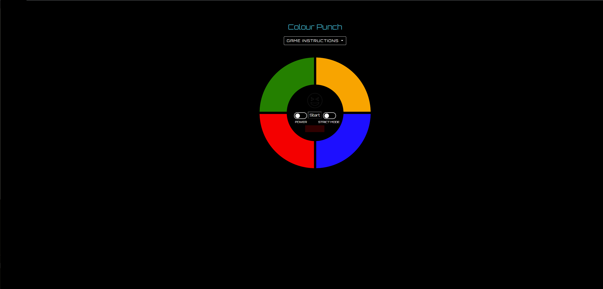
#
## Instructions
- Simply match the sequence displayed, if you follow correctly then you score a point.
- If the player scores ten points they win the game
- The player can activate the strict button which will reset the game if the player loses the game. 
- If the strict button is switched off then the player simply starts where they left off.
#
## User Stories
1. I would like to play a game thats asthetically pleasing and challenging with good features.
2. I like games from my childhood like "Bop It", "Simon" and "Hungry Hippos" so a mobile version of one of those would bring back a lot of memories.
3. #### I would like to know how the game is played with good, clear information that's well presented.
#
## Game designer goals
1. To build a game based on a users familialarity with vintage games from their childhood.
2. To make the games appearance colourful and well presented.
3. To add functionality in the form of additional features to make it authentic.
## Future game designer goals
1. To add audio clips when the colours flash
#

## UX - Design
#
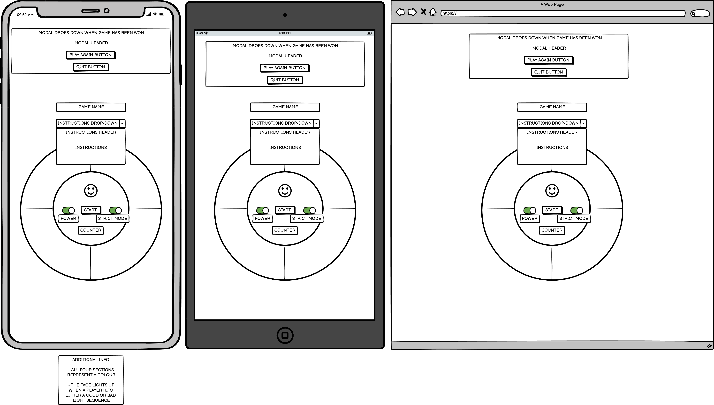
#
## Languages
#### [HTML5](https://en.wikipedia.org/wiki/HTML5)
#### [CSS3](https://en.wikipedia.org/wiki/CSS)
#### [Javascript](https://en.wikipedia.org/wiki/JavaScript)
#
## Libraries
[Bootstrap 4.4.1](https://blog.getbootstrap.com/2019/11/28/bootstrap-4-4-1/)
[Font-awesome V5.15](https://fontawesome.com/)
[Google Fonts](https://fonts.google.com/)
#
## Typography & Colour Scheme
## 1. Layout colours
- I kept this nice and simple as there is only one page to the project the colour scheme is pretty straight forward. I decided to break up the page by adding two colours for the page layout:
- Goldenrod - this was used for the STRICT MODE instructions, modal font icons and one of the game buttons.
- HEX Code: #17a2b8 - For the page title, instructions in the drop down & toggle switches ( when activated ), both colours seem to compliment eachother quite nicely and go really well with the font design.
## 2. Game buttons
- The decision on colour choice was pretty simple for the buttons, I had to make sure they were the right shades as the lighter shades of each have to be distinctive enough for the player to notice the change when playing the game.
## 3. Typography - Font
- The theme of the project is a game so I wanted to find a design that would compliment this, the font chosen is 'Orbitron' with a default backup of sans-serif. This font goes really well with the colour scheme and gives it a futuristic effect. This font was also used for the round counter to give the text (when displayed) a bit more volume to fill out the space when activated. 
## 4. Font Icons
- I added two trophy icons to the modal, this was a great decision as it adds more animation to the feature.
- I decided to add an additonal font icon to display with text in the round counter box when a player makes a mistake with the colour sequence. I think this finished off that feature quite nicely as it makes the game seem more genuine when you play it instead of text on its own.
#
## Functionality
## 1. Source code
- The base code was implemented by following a [Simon Game by Beau Carnes - freeCodeCamp.org](https://www.youtube.com/watch?v=n_ec3eowFLQ) tutorial. This project is for educational purposes so I wanted to get a better grip on improving my javascript skills, I found the tutorial to be very useful when it came to getting a different take on how to structure Javascript.
## 2. Additional functionality
I wanted to make this game my own so after following this tutorial and getting a better understanding I found myself improving the game buy adding my own functionality:
- A static font icon that lights up in the middle of the board when a player gets a sequence right or wrong (Green for right and Red for wrong), an additional thumbs down and thumbs up icon was added to the counter box when player scores correctly and  incorrectly.
- A modal displays when the player has reached ten points, this also includes individual functionality attached to a quit button and a play again button:
- The quit button reset the colours and displays "READY" on to the counter
- The play again button simply resets the game and starts the sequance again from round one
- Both buttons also have additional functionality that resets the inner-board icon back to it's default colour of 'Black' when the player clicks either buton.
#
## Development Bugs & Testing
### Development:
1. Syntax error in for loop - line 91-93. User unable to complete round due to typo:
###
### 
- for ( let i = 0; i < 2; i++ ) {
        colorOrder.push(Math.floor(Math.random() * 4) + 1);
    }
1.1: ( i ) should be less than 10, not 2. This would result in user not being able to get past the third round.
2. Unresponsive adjustment - device screens. // Unresolved.
- Scalability implemented for ganme to adjust to device screens but issue still occurs until you double tap your screen.
- Screenshots for only one device included as this is the same outcome so seems pointless to include everything to prevent repetitiveness.
#

| Before Tap  | After Tap| 
| ------------- | ------------- |
| 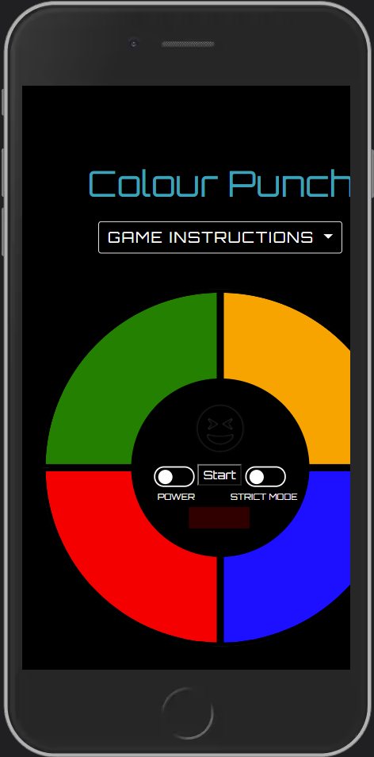 | 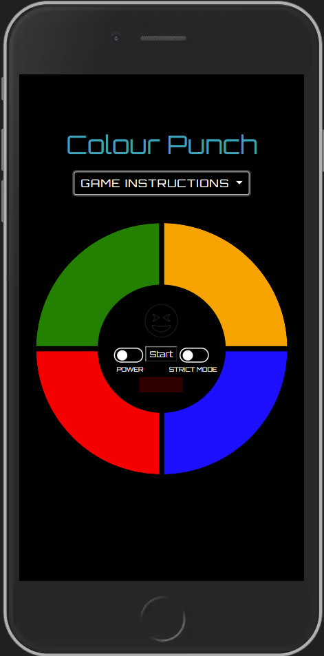  |
#

## Code Validator Files
- #### [HTML](images/HTML-Validator.png)
- #### [CSS](images/CSS-Validator.png)
- #### [Javascript](images/Javascript-Validator.png)
#
##  User Testing
### Layout
- I like that the creator has based the design on the "Simon" game. The layout is identical to the physical version, only the colours are more vivid and the game acts the same way which is great.
### Game Play
- I found the game to increase in difficulty as it went on. This challenged me which is exactly what I specified in my requests. 
### Additional Features
- The fact that the developer has included both a screen to display the level I'm on and a digital icon that changes colour to respond to the game play with an additonal thumb icon to determine a good play or bad play is great, it shows a lot of effort and attention to detail went in to making this. I found that this really improves my experience. Plus, it's really addictive and frustrating in a good way!
- The game also has instructions on how to play which is really good becuase it explains how many levels there are to win and an explanation on the strict mode button.
#

| Power On  | Power Off | Strict Mode On  | Strict Mode Off |
| :---: | :---: | :---: | :---: |
|   | 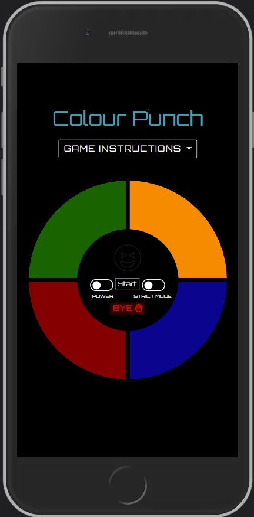 | 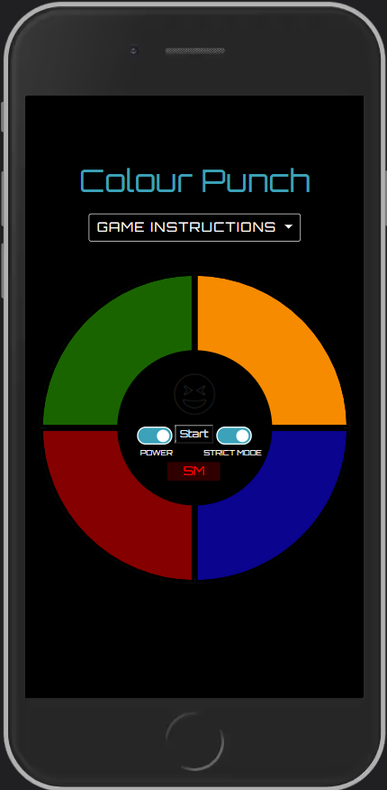 | 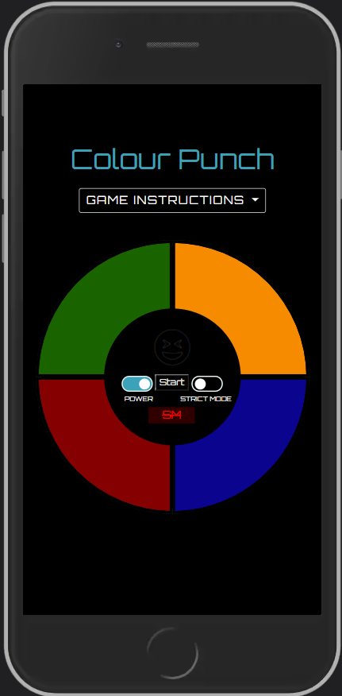  |

| Good Move  | Bad Move | Game Instructions  | Player Wins |
| :---: | :---: | :---: | :---: |
| 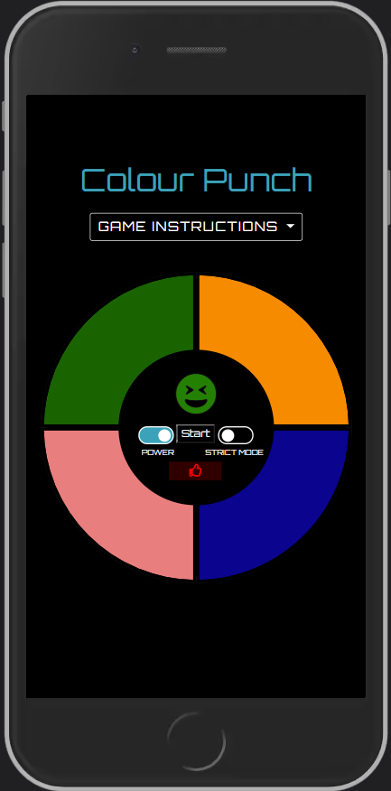  | 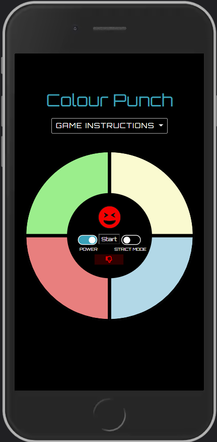 | 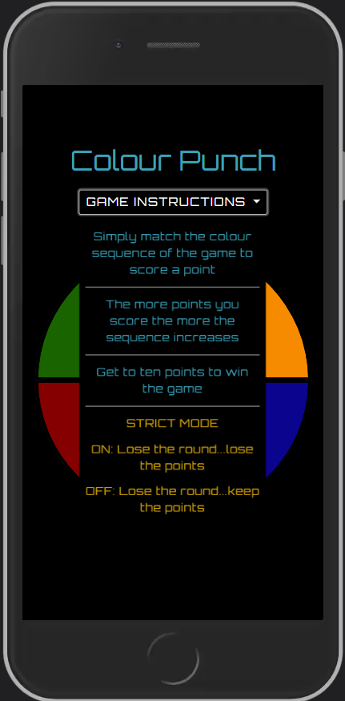 | 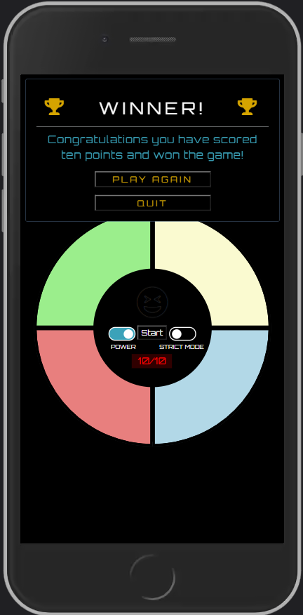  |
#
## Devices & Browsers
### Browsers
- Live site was tested on Google Chrome and Firefox. Responsiveness and layout are exact no issues found.
### Devices
- Samsung Galaxy A21S & iPhone 6 - colleagues handset. Responsivness issue highlighted in the Unresponsive adjustment - device screens section still showing.
#
## Cloning & Deployment
### To clone this repository do the following:
1. Navigate to the main page of the repository.
2. Above the list of files, click the Code button in green
3. To clone the repository using HTTPS, under "Clone with HTTPS", click clipboard icon on right. To clone the repository using an SSH key, including a certificate issued by your organization's SSH certificate authority, click Use SSH, then click clipboard icon. To clone a repository using GitHub CLI, click Use GitHub CLI, then click clipboard.
4. Open Git Bash.
5. Change the current working directory to the location where you want the cloned directory.
6. Type git clone, and then paste the URL you copied earlier and update the username and repository name.
7. Press Enter to create your local clone.
### To deploy your repository do the folowing:
1. Navigate to your repository in gitHub by clicking your profile icon in the top right hand corner and then selecting "Your repositories" in the drop-down menu.
2. Select the repository.
3. Navigate to the "Settings" tab and select.
4. Scroll down to the GitHub Pages section and click the link.
5. Under "source" section change the branch name from 'None' and choose 'Main', making sure the folder  is set to 'root'.
6. Select 'Save'. The page should now produce a URL for your published site.
#
