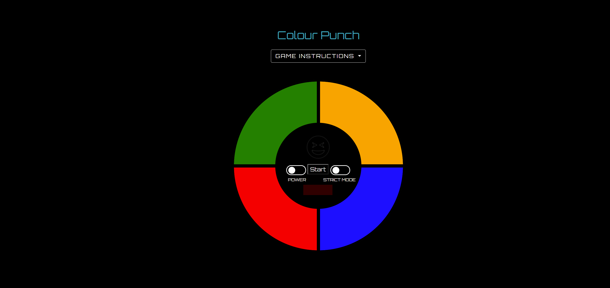

# Colour Punch - MS2 Re-write.
## Overview
### "Colour Punch" is a take on the classic game called 'Simon', where players try to memorise the colour combination generated by the game. The more colours you memorise or "punch" correctly, the more your score increases.
#

#
## Instructions
* Simply match the sequence displayed, if you follow correctly then you score a point.
* If the player scores ten points they win the game
* The player can activate the strict button which will reset the game if the player loses the game. 
* If the strict button is switched off then the player simply starts where they left off.
#

## Design

#
## Typography & Colour Scheme
### 1. Layout colours:
* I kept this nice and simple as there is only one page to the project the colour scheme is pretty straight forward. I decided to break up the page by adding two colours for the page layout:
* Goldenrod - this was used for the STRICT MODE instructions and one of the game button.
* HEX Code: #17a2b8 - For instructions in the drop down, both colours seem to compliment eachother quite nicely and go really well with the font design.
### 2. Game buttons:
* The decision on colour choice was pretty simple for the buttons, I had to make sure they were the right shades as the lighter shades of each have to be distinctive enough to notice the change when playing the game.